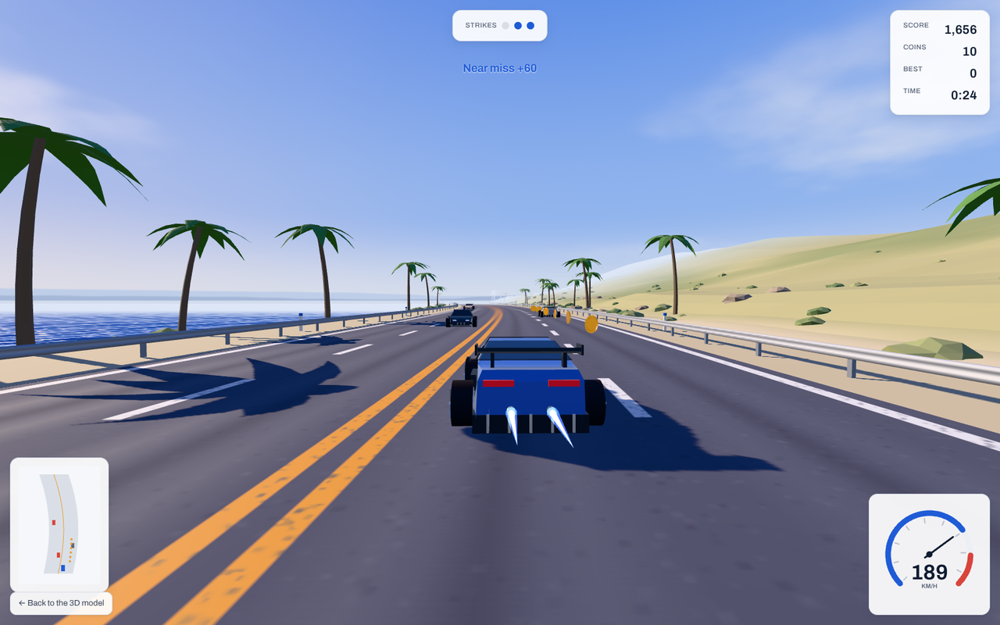

<picture>
  <source media="(prefers-color-scheme: dark)" srcset="public/wordmark-light.svg">
  
</picture>

An endless two-way coastal highway that plays in the browser. Traffic on your
side is slower than you; the left lanes come at you head-on. Collect coins, clip
the boost pads, miss the cones. Three strikes ends the run.

**Play it:** https://eaustine.github.io/coast-run/
**Inspect the car:** https://eaustine.github.io/coast-run/supercar.html



## Controls

| | Keyboard | Touch | Gamepad |
|---|---|---|---|
| Steer | A / D or the arrow keys | left thumb zone | left stick or D-pad |
| Throttle | W or up | Gas | RT (analog) or A |
| Brake | S or down | Brake | LT (analog), B or X |
| Mute | M | sound button | Y |
| Start or restart | Enter | Start run | Start or A |
| Change paint (menu) | click a swatch | tap a swatch | LB / RB |

## What's in it

- **The car** is an original mid-engine design built from primitives in code:
  an extruded side profile tapered into a body, with named parts and seven
  materials. The viewer page exports it as OBJ + MTL or GLB.
- **The world** bends around a player who never moves. Road, terrain, the sea
  and the roadside are rebuilt every frame from one curve function, so the
  coastline follows the highway.
- **The sky** is painted once into a cube map at start-up and lights the whole
  scene, with one low sun for shadows.
- **About 100 draw calls** for a full scene. Traffic, coins and scenery are
  instanced, and the game steps its own quality down on slower devices.
- **Keyboard, touch and gamepad** feed one set of controls, and the layout
  follows whichever you used last.

No model, texture or sound files: everything is generated in code.

## Run it locally

```bash
npm install
npm run dev            # http://localhost:5173
npm run build          # type-check, then build the site into docs/
npm run preview        # serve the built site
```

`docs/` is the built site, and it is what GitHub Pages serves (Settings >
Pages > Deploy from a branch > `main`, `/docs`). Run `npm run build` and commit
`docs/` whenever the source changes.

## Source layout

```
public/                 icons, social card, manifest, wordmarks (copied into docs/ as is)
src/
  main.ts               composition root for the game
  car/                  the car model, its merged form for traffic, wheels and flames
  world/                road ribbons, sky, terrain and sea, roadside props, lights
  entities/pools.ts     traffic, coins, obstacles, pads and skid marks
  game/                 constants, run state, input, the simulation loop
  hud/                  speed gauge, minimap, panels and toasts
  audio/engine.ts       synthesised engine and wind
  viewer/main.ts        the model viewer and exporters
  styles/               tokens.css, fonts.css, game.css, viewer.css
notes/                  build notes: the visual brief and the screenshot above
GAME.md                 every tuning number and the change history
```

## Built with

[three.js](https://threejs.org) (MIT), TypeScript and Vite. Type is
[Archivo](https://github.com/Omnibus-Type/Archivo) by Omnibus-Type, under the
SIL Open Font License 1.1 (`src/assets/fonts/Archivo-OFL.txt`).
