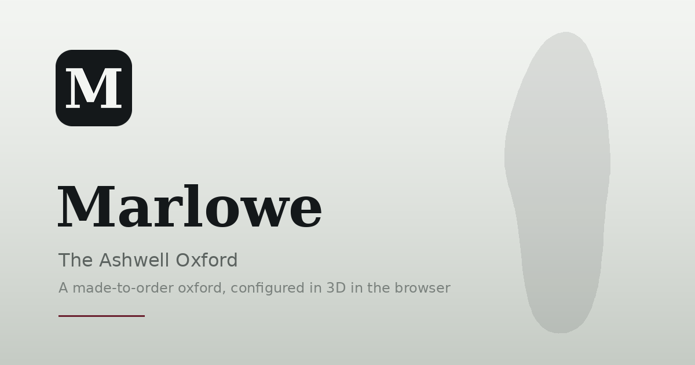

# Marlowe — The Ashwell Oxford

A made-to-order dress shoe configured in 3D in the browser. Pick a part, pick a
leather, watch the shoe change. No build step, no framework, no bundler.

**Live:** https://eaustine.github.io/marlowe-oxford/



---

## What this is

Most product configurators split the job across two rails: options down one
side, a summary card down the other. The same facts live in two places and
neither is authoritative.

Here the **part rail is the summary**. Each pill along the bottom carries the
name of a part and its current value, so the row reads as the whole build at a
glance. Selecting a pill swaps the option sheet and flies the camera to the
angle that actually shows that part: the sole drops below the horizon, the
eyelets come in close and high. There is no separate summary card because the
rail already is one.

The 3D is real geometry with per-zone materials, not a pre-rendered image
sequence. Seven zones (quarters, vamp, toe cap, tongue, sole, laces, eyelets)
are separately addressable, which is what makes a contrast toe cap or brass
eyelets a one-line material swap.

Every leather texture is generated in JavaScript at load, on a canvas. There are
no texture files in this repository.

---

## Running it

The page fetches the model over HTTP, so opening `index.html` straight off disk
will not work. Serve the folder:

```bash
python3 -m http.server
# then open http://localhost:8000
```

Any static server does. If you open it from `file://` the page says so and tells
you this.

## Deploying to GitHub Pages

1. Push this folder to a repository.
2. Settings → Pages → Build and deployment → Source: **Deploy from a branch**,
   branch `main`, folder `/ (root)`.
3. Wait for the first build, then open the URL Pages gives you.

`.nojekyll` is already present, which stops Jekyll from touching the asset
folders.

**Before you publish, replace the URL in four places** with your own:

| File | What to change |
|---|---|
| `index.html` | `<link rel="canonical">`, `og:url`, `og:image`, `twitter:image` |
| `robots.txt` | the `Sitemap:` line |
| `sitemap.xml` | the `<loc>` |

They currently read `https://eaustine.github.io/marlowe-oxford/`. The social
card will not render on Twitter, LinkedIn or Slack until `og:image` is an
absolute URL that resolves.

## Linking it from a portfolio

The project is a single page with no routing, so an `<iframe>` or a plain link
both work. A build is encoded in the URL hash, which means you can deep-link a
specific pair:

```
https://eaustine.github.io/marlowe-oxford/#cordovan.0.contrast.dainite.dark.natural.brass.AE
```

That is leather, colour index, toe cap, sole, edge, laces, eyelets, monogram.
The **Copy link to this build** button under the price produces one.

---

## Layout

```
index.html                    markup and head metadata
css/marlowe.css               tokens, layout, responsive rules
js/
  glb-loader.js               ~70-line glTF binary reader, no dependency
  catalogue.js                options, prices, rules, URL encoding
  app.js                      stage, materials, camera, interface
assets/
  model/marlowe-oxford.glb    the shoe, 7 named zones, 16,520 triangles
  brand/                      favicons, maskable icon, social card
tools/
  make-brand.py               regenerates every brand asset
  sole-outline.json           sole outline traced from the model itself
site.webmanifest              installable web app metadata
```

### Where to make changes

| You want to | Edit |
|---|---|
| Add an option or change a price | `js/catalogue.js` only |
| Change a leather's surface | the `LEATHER` block in `js/catalogue.js` |
| Re-colour the interface | the `:root` tokens in `css/marlowe.css` |
| Point a zone at a different material | `paint()` in `js/app.js` |
| Host the model elsewhere | set `window.MARLOWE_MODEL_URL` before `js/app.js` |

`catalogue.js` is the single source of truth. The 3D materials, the option
sheet, the running total and the share link all read from it, so adding an
option is one edit in one file.

---

## How it was built

The shoe started as procedural geometry: a last defined by twelve cross-sections,
lofted into a surface, with each panel cut as a region of that surface. Six
passes in, the silhouette still would not match a reference photo, because
every dimension was inferred by eye and the errors compounded faster than they
could be corrected.

The model now comes from a third-party GLB, which arrived as a joined scene with
**one material across the whole thing**. A union-find pass over the welded
vertices found 38 separate shells in mirrored pairs: a complete pair of shoes
plus props. The build script isolates one shoe, runs PCA on the sole to find its
true long axis and rotates it straight, works out which end is the heel from
where the mass sits, classifies the shells geometrically rather than by name
(the names were Blender defaults like `Plano.004`), carves a toe cap out of the
vamp with a transverse plane at 72% of the length, and writes a fresh GLB with
one named material per zone. 2.9 MB in, 374 KB out.

### Measured against the reference

Checked with the gate scripts from Anthropic's `precision-3d-creation` skill:

| Check | Result |
|---|---|
| Units and axes | 2.80 × 1.07 × 0.98, Y-up, origin at the heel on the ground |
| Mesh validity, realtime profile | 16,520 triangles, 0 non-manifold edges, 0 degenerate faces |
| Silhouette IoU vs reference photo | **0.856** |
| Aspect error | **+5.2%** |

The silhouette number clears the 0.85 blockout bar and misses the 0.92 final
bar. It should miss it: the reference photo and the model are two different
shoes, so the remaining gap is last shape, not error. The measured differences
are a vamp that slopes down slightly early, a toe about 4% long, and a sole
thinner through the waist.

### Known limitations

- The grain UVs are computed from object space, not from the model's own
  unwrap, because the source was unwrapped for a single baked texture and the
  island scale varies wildly between parts.
- Suede is faked. Real suede scatters light through its nap; this lifts the
  grazing angles with a Fresnel term, which is the part the eye reads as nap.
  Judge it on the silhouette rather than head-on.
- There is no brogue or derby variant. The mesh has no perforation geometry and
  no open-lacing option, so those were cut rather than faked.
- The monogram is priced and stored but not rendered on the insole.
- `tools/make-brand.py` falls back to DejaVu Serif. Install Fraunces locally and
  point `SERIFB` at it to regenerate the social card in the real brand face.

---

## Brand assets

Regenerate everything in `assets/brand/` with:

```bash
pip install pillow fonttools
python3 tools/make-brand.py
```

The wordmark glyph is extracted as a real vector outline, so `favicon.svg` is a
path rather than a `<text>` element and renders identically everywhere.

An earlier version of the icon used the shoe's own sole outline, traced from the
model and kept in `tools/sole-outline.json`. It was dropped for the favicon: a
sole is 2.86 times longer than it is wide, so inside a square it collapses to a
sliver by 16px. It survives as the large-format device on the social card.

## Stack

Three.js r128 from a CDN. Fraunces and Inter Tight from Google Fonts. Nothing
else. No npm, no build, no framework.

Tested in current Chrome, Safari, Firefox and Edge. Needs WebGL; the page says
so if it is missing. Honours `prefers-reduced-motion` by disabling the camera
easing and the idle turntable.

## Licence

Code and brand assets: MIT, see [LICENSE](LICENSE).

`assets/model/marlowe-oxford.glb` is **derived from a third-party dress-shoe
model** and is not covered by that licence. Check the source model's terms
before redistributing it or using this commercially. Swap in your own model by
replacing that file and keeping the seven mesh names.

Marlowe is a fictional brand invented for this project.
