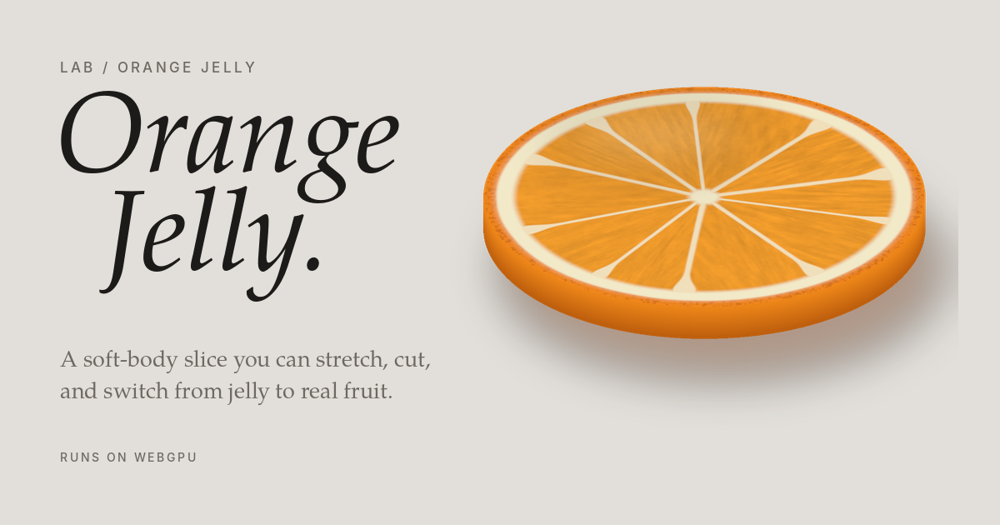

# Orange Jelly

A soft-body orange slice you can stretch, cut, and switch from jelly to real fruit. Runs on WebGPU.

**Live:** https://eaustine.github.io/orange-jelly/
**Part of:** [Austine Eluro's Lab](https://austineeluro.com/lab/)

## What you can do

- **Hand:** grab the slice anywhere and pull. Scroll, or add a second finger, while holding to twist it.
- **Knife:** draw a line across the slice. The knife lines up over your stroke and cuts when you let go. Cut the pieces again, up to 14.
- **Variety:** Navel, Blood or Ruby.
- **Material:** Jelly (translucent, wobbly) or Real fruit (firm, matte, crisp-edged).
- **Firmness and damping:** tune how the body moves.

Keyboard: `Space` pause, `N` nudge, `R` reset, `K` knife, `H` hand, `M` switch material.

## Link options

Add these to the URL to open it in a set state. Combine them with dashes.

| Token | Effect |
| --- | --- |
| `#poster` | Hides the interface, for clean screenshots and screen recordings |
| `#jelly`, `#fruit` | Picks the material |
| `#navel`, `#blood`, `#ruby` | Picks the variety |

Example: `https://eaustine.github.io/orange-jelly/#poster-fruit-blood`

## How it works

- **Physics:** the slice is a mesh of tetrahedra solved with XPBD at 60 Hz in 10 substeps. Each tetrahedron is pulled toward its rest shape and holds its volume, so a stretched slice necks in.
- **Cutting:** every piece is a convex outline in the slice's original flat layout. A stroke becomes a straight line in that layout, the outline is split, and two new soft bodies take over the motion of the flesh they came from.
- **Look:** zest, pith, segments and juice vesicles are computed in WGSL shaders from each point's distance and angle from the centre. No textures. Jelly mode measures thickness per pixel for refraction and colour absorption; Real fruit mode swaps that for an opaque, textured surface.
- **No dependencies:** one HTML file, no libraries, no build step.

## Browser support

Needs WebGPU: current Chrome, Edge and Safari on desktop, and Chrome on Android. Other browsers see a message explaining why the page is dark.

## Files

| File | Use |
| --- | --- |
| `index.html` | The whole piece |
| `favicon.ico`, `favicon.svg`, `favicon-32.png` | Browser tab icons |
| `apple-touch-icon.png` | iOS home screen |
| `icon-192.png`, `icon-512.png`, `icon-maskable-512.png` | Android and installed app icons |
| `site.webmanifest` | App name, colours and icons |
| `og-image.png` | Link preview on Slack, LinkedIn, X and iMessage |
| `lab-card.png` | Image for the portfolio Lab card (1600 × 1200) |

## Credits

The physics, cutting and rendering engine come from **Melon Jelly**, an interactive study shared as a Claude artifact. I could not trace its author. If it is yours, get in touch and I will credit you by name.

This remix adds the round orange wheel, the citrus anatomy in the shader, the three varieties and the real-fruit material mode. Directed by Austine Eluro, built with Claude.
